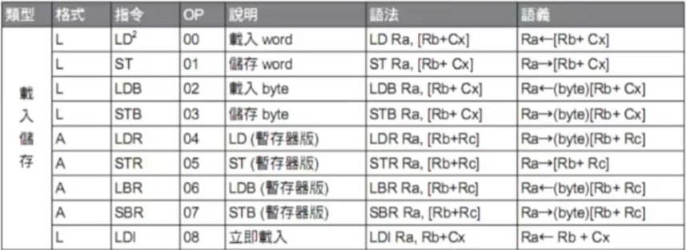
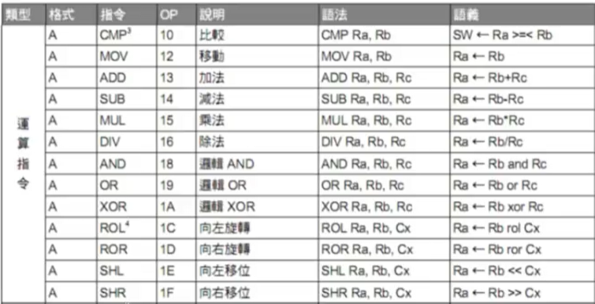
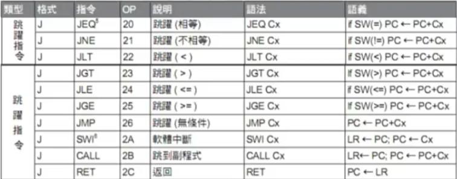
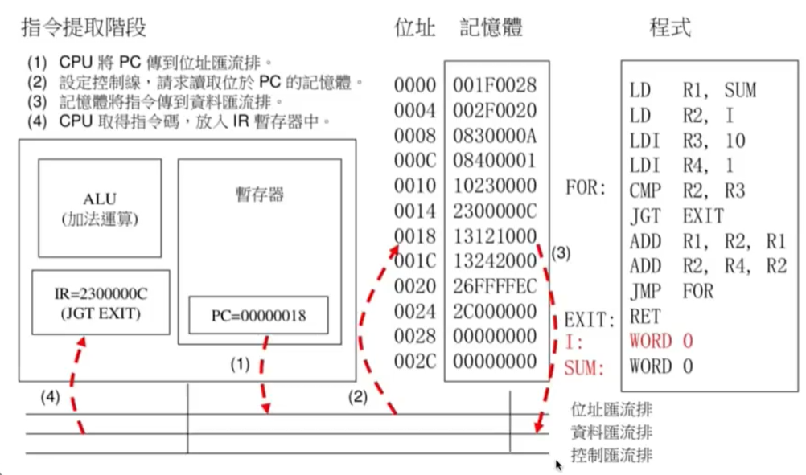
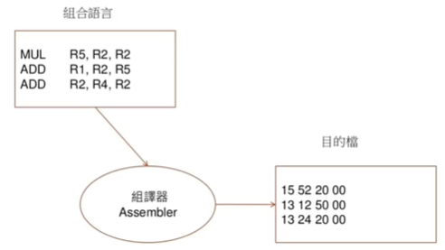
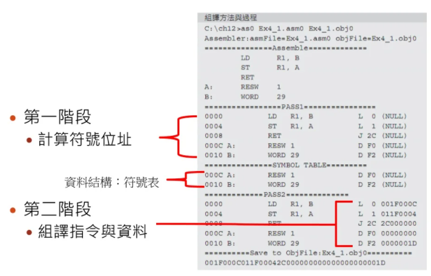
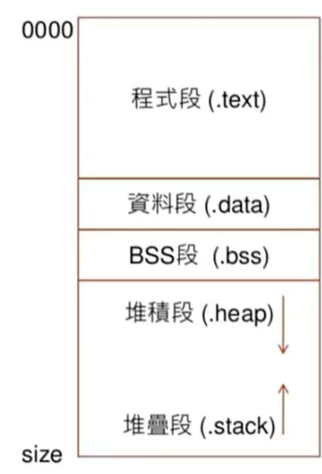

筆記參考網址: 

* [系統程式 -- 第二章 電腦的硬體結構](https://www.slideshare.net/ccckmit/2-73472886)
* [系統程式 -- 第三章 組合語言](https://www.slideshare.net/ccckmit/3-73472890)
* [系統程式 -- 第四章 組譯器](https://www.slideshare.net/ccckmit/4-73472893)
* [系統程式 -- 第五章 連結與載入](https://www.slideshare.net/ccckmit/5-73472900)
* [課程直播]([Facebook](https://www.facebook.com/ccckmit/videos/2738410292969713))

C語言的強大在於指標，他跟UNIX一起起來，但也很危險


#### C 常錯寫法

```c
double a[3]; // 陣列要給大小
double c[] = {1,2,3}  // 初始化陣列要用大誇號
double d[3] = {1,2,3}
sizeof(a);  // 只會拿到站記憶體的大小，不會拿到陣列的大小

// 要傳回陣列需要用指標傳回
double* add(double a[], double b[]){
    double c[3]
    return c;
}

int main(){
    // 接收要用指標，而非陣列
    double *c = add({1,2,3}, {3,2,1})
}
```


#### 動態分配空間

```c
malloc()  // 用來分配動態矩陣，malloc用多了速度會變慢，通常malloc會自製
   
// 寫C盡量靜態化，才不會站內存
    
// 使用malloc後，後面一定要加上free
    
double a[5] = {1};

// malloc(sizeof(a) * sizeof(double)) ??
double *c = malloc(sizeof(a));  // ??? c[4]?  // 設定動態容器大小

// malloc 失敗要進行錯誤處理
if (c==NULL) {printf("malloc fail"); exit(1);}
//.....
free(c);

// malloc 出現 就要出現 free，不然會一直卡記憶體
```


#### C 陣列陷阱

```c
#include<stdio.h>
#include<stdlib.h>

void add(double a[]){
    printf("%d", sizeof(a));  // 8  // 因為 傳入(double a[])其實是指標(double* a)
}

int main(){
    double a[] = {1.0,2.0,3.0,4.0};
    double b[] = {1.0,2.0,3.0,4.0};
    double *c = malloc(sizeof(a));

    int len = sizeof(a);
	printf("%d", sizeof(a))  // 32
    printf("%d", sizeof(c))  // 8
    add(a);
}
```


#### 微積分程式碼

```c
#include <stdio.h>

double h = 0.01
// 微分
double f(double x){
    return x*x;
}

double df(double (*f)(double), double x){ // 對f作微分
    return (f(x+h)-f(x))/h  // 微分定義 斜率
}

double intergral(double (*f)(double), double a, double b){ // 對f作積分
    double area = 0.0
    for (double x=a; x=b; x+=h){
        area += f(x)*h
    }
    return area  // 積分定義 面積
}

double intf(double x){
    return intergral(f, 0, x);
}
int main(){
    printf("df(f, 2.0) = %f\n", df(f, 2.0)) // 微分
    printf("intergral(f, 0, 2) = %f\n", intergral(f, 0, 2)) // 積分
        
    double x = 3.0;
    printf("d  int(f, 0,x)/dt = %f\n"+df(intf, x)); // 微積分基本定理(微分後積分等於自己(f(x)))
}
```


```c
#include <stdio.h>
typedef struct{
    double r, i;
}Complex; // 定義 結構 Complex

// 對大型結構來說，加上*會讓程式運行較快，*加在前面和後面都可以(Complex *c1, Complex* c2)
Complex add(Complex *c1, Complex *c2){ // 加上*可以改變傳進來的參數，如果沒有加，會創建一個新的，這裡的c1代表是位置
    Complex c;
    // c1->r == (*cl).r // *c1代表取位置裡面的值
    c.r = c1->r + c2->r; 
    c.i = c1->i + c2->i;
    return c;  // 回傳結構變數
}
int main(){
    Complex o1={.r=1.0, .i=2.0};
    COmplex o2={.r=2.0, .i=1.0};
    Complex add12 = add(&o1, &o2); // 傳位置給函數
}
```


有記憶體映射和IO控制，讓C語言成為<系統軟體與嵌入式系統>的主力


#### C 觀念

```c
#include <stdio.h>
#include <string.h>

// 要處裡的資料通常會放前面
// 指標代表可以連結到符合類型的容器的第一個位置，也可以傳單個
void SlowStrcpy(char *a, char *b){ // O(n^2)
    // 編譯器會一直呼叫strlen，造成效能下降
    for(size_t i = 0; i <= strlen(b); i++){
    	a[i] = b[i];
    }
}
void MediumStrcpy(char *a, char *b){ // O(n)
    size_t len = strlen(b);
    for(size_t i = 0; i <= len; i++){
    	a[i] = b[i];
    }
}
void FastStrcpy(char *a, char *b){ // O(n)
    char *ap=a, *bp=b;
    while (*bp) {  // 取到容器最末端 '\0'
        *(ap++) = *(bp++);
    }
    *ap = '\0';  // 告知容器結束，如果不加上，下次讀取容器會一直往後讀取，然後爆掉
}

int main(void){  // void要加，才符合規定語法，不然就要填入(int argc, char *argv[])
    char x[10], y[] = "hello";
    FastStrcpy(x, y);
    printf("x=%s y=%s \n", x, y);

}
```

* **x[10]，x代表他開始的地址，後面的[n]代表容器大小**
* *pointer和&pointer 都是取地址的值 ，`char *` 代表宣告指標類型
* **每個容器最後面後面都會有**`'\0'`**，宣告容器結束，創建矩陣會自動添加**

`size_t` 在32bit架構定義為 `unsigned int`

`size_t` 在64bit架構定義為 `unsigned long int`

## CPU0處理器

> [系統程式 -- 第二章 電腦的硬體結構](https://www.slideshare.net/ccckmit/2-73472886)

> 由陳鍾誠教授開發的簡易32bytes處理器，跟hackCPU相比，較貼近現代的處理器


CPU0架構圖


hackCPU只有兩個暫存器 A 和 D，另外一個PC要操控必須用JUMP。


#### CPU0 暫存器

> **CPU0有16個暫存器**

* R0是唯獨的，永遠都是0，這樣的好處是可以下降指令數量(像是Mov可以使用Add完成)
* R15是程式計數器(Program Counter)，紀錄目前執行到哪個指令
* R14是連結暫存器(Link Register)，當呼叫副程式(CALL)，PC會放一份在LR，在切回到主程式時(RET)，再把LR放到PC
* R13是堆疊指標(Stack Pointer Register)，push、pop指令就會把 SP+1或-1，移動堆疊最頂端
* R12是狀態暫存器(Status Word)，有兩個位元，用來存是不是0 (zr) 和是不是負的 (ng) 
* 其他的都是通用暫存器


CPU0結構 = ALU +暫存器 + 控制單元 (所有處理器都有的基本元件)


#### CPU0 指令集

> 有四大類的指令

* 載入儲存: LD, ST, LDB, ...，一個word 4 bytes(32bits)

  

  

* 運算指令: ADD, SUB, XOR, SHL, ROL, ...，C語言沒有支援左旋右璇的功能，需要自己寫

  

  

* 跳躍指令: JMP, JGT, JGE, ...，執行過一次CALL跳到副程式還要再進副程式(函數...)，要把LR丟到堆疊裡面，不然會回不去主程式

  

  * `JMP[0x30]` 代表往前跳 48bit (30=3*16+0=48)

  

* 堆疊指令: PUSH, POP, ... ， -4是因為一個word佔4 bytes

  


#### CPU0指令格式

* A型的C只能表示 +2048 ~ -2047，暫存器有3個

* L型的C可以表示  +32768 ~ -32767，暫存器有2個

* J型的C可以表示  +(2^23) ~ -(2^23-1)，沒有暫存器


#### CPU0 狀態暫存器

現在很多硬體都會保留位元，而且通常在好幾代以後會用到保留位元，像Ascii使用8bytes，但它只有用7bytes。

BIG5在把中文加入系統中時，就有用到第8個byte，表示中文的前部分，後面8bytes表示後部分，這樣一共可以表達3萬多個字符((256-128)*256)，足以把常用的中文紀錄了!


處理器模式現在處裡器基本都有，像RISC-V就有3種模式


#### 定址模式

> 定址也是每一個CPU必備的功能，一共包含下面幾種類型

* 立即定址: 把後面的值塞到前面的 Register

  * 指令: LDI

  * 格式: `LDI Ra, Rb + Cx`
  * `LDI R1, R2 + 100` : 將 R2 +100 放入 R1，相當於 R1 = R2 + 100
  * `LDI R1, R0 + 100` : 相當於 R1 = 100可以簡寫為 `LDI R1, 100`

* 相對定址: 把記憶體位置(暫存器的值+常數)的數據塞到指定 Register 

  * 指令: LD, ST, LDB, STB

  * 格式: `指令 Ra, [Rb + Cx]`

  * `LD R1, [R2 + 100]` : R1 = [R2 + 100]，取出記憶體位置R2 + 100 裡面的內容，放到 R1 中
  * `ST R1, [R2 + 100]` : 將 R1 的內容存入記憶體位置 R2 + 100 裡面

* 索引定址: 把多個記憶體位置(暫存器的值相加)的數據塞到指定 Register 

  * 指令: LDR, STR, LBR, SBR

  * 格式: `指令 Ra, [Rb + Rc]`

  * `LDR R1, [R2 + R3]` :  存取兩個暫存器的值，相加後存取記憶體的數據放到R1

* 絕對定址: 把記憶體位置(暫存器的值+常數)的數據塞到指定 Register 

  * 指令: LD, ST, LDB, STB

  * 格式: `指令 Ra, [Cx]`  ，CPU0這裡要使用`[R0+Cx]`

  * `LD R1, [100]` : R1 = [R2 + 100]，取出記憶體位置 100 裡面的內容，放到 R1 中


#### CPU0的程式執行

> 程式運作的過程中，指令會一個一個被提取後執行，直到跳躍指令出現為止

> 一個指令執行包含下面主要的三階段

1. 提取: 由PC決定提取哪個指令，**提取完馬上 PC+4**
2. 解碼
3. 執行: 會存取記憶體




在做IO時雖然CPU基本上沒甚麼用到，但是會影響到時脈，存取記憶體一定比存取IO還快，所以匯流排(主機板)的設計其實非常難


> 組合語言

* 現在能學的組合語言應該是RISK-V和x86，不過這東西變換太快了，以後會用的組合語言通常都不是現在學的
* CPU0的架構和內容可以看[系統程式 -- 第三章 組合語言](https://www.slideshare.net/ccckmit/3-73472890)，課程到後面會講RISK-V和x86


## 組譯器

> [系統程式 -- 第四章 組譯器](https://www.slideshare.net/ccckmit/4-73472893)

上學期有看過hackCPU的組譯器，不過它很陽春，沒有巨集的功能。

* 組譯器是把組合語言轉換成機器碼的工具
* 組合語言 --> 組譯器 --> 目的檔(或執行檔)

 

`15 (代表執行MUL指令) 5 (R5) 2 (R2) 2 (R2) 0 0 0 (後三個指令沒用到，所以全部填0)`

管線式的精簡指令集通常都會固定長度(為了讓管線效率提升，管線會以最長的那個作為處裡的速度)，但複雜指令集就不一樣，每個指令會有不同長度，有的1bit，有的8bit，這樣就會很難處裡，所以現在通常都是用精簡指令集


通常存取區域變數使用stack，而malloc(C)和new(C++)則會使用到heap，heap會存在記憶體內，所以用完如果沒有要用，需要釋放掉(free)，C#和python和JavaScript的new那個又是不同東西了，跟C++的不一樣，是創立一個新物件。


RESW(有格式的目的檔)是使用bss存取，而WORD(有設定初始值)是使用data進行存取


把上面的組合語言程式碼編譯成目的檔編碼


通常都是使用相對定址的編碼，因為彈性比較大，如果用gcc去編的話，裡面有一個參數 PIC(Position Independent Code)，代表跟位置無關編碼方式，通常都會使用。


#### 映像檔

* 代表最簡單的目的碼

* 組合語言 --> (組譯器) --> 映像檔

  

厲害的編程員都會玩2進位的技巧，C語言就很適合拿來當工具，可以用來寫虛擬機、組譯器、5G基地台....


#### 組譯器演算法



這個是 PIC(Position Independent Code) 目的碼 (映像檔)，採用相對於PC的定址法，因此不管目的檔被載入到記憶體的哪個位置，都可以直接執行，不需要進行任何修正!

第一輪先取得A、B變數位置(左邊是顯示指令位置，從0000開始每次加上4bit)

後面編碼:

001F000C(B位置: 0010-0004(相對於程式計數器PC) = 000C)

011F0004(A位置: 000C-0008 = 0004)


## 連結與載入

> [系統程式 -- 第五章 連結與載入](https://www.slideshare.net/ccckmit/5-73472900)

#### 簡介

* 目的檔

  * 一種由程式機器碼與資料碼所組成的格式化檔案結構

  * 組譯時若有外部標記

    * 則必須保留這些外部標記以代連結時進行處裡
    * 這種保留外部標記的機器碼檔，就稱為目的檔

  * 通常會有程式段、資料段、BSS段，如果有加除錯資訊還會有除錯段，另外還有符號表、字串表...

    

* 執行檔

  * 目的檔連結完成後，就會輸出可執行檔
  * Windows: test.exe, csc.exe...，Window的執行檔跟副檔名相關
  * Linux: a.out, test.o...，Linux是寫在檔案裡面

* 連結器

  * 將許多目的檔連結成一個執行檔的程式

* 載入器

  * 將可執行檔載入到記憶體當中執行的程式


#### 載入器

> 簡單的載入器演算法 (對於PIC)

```
Algorithm SimpleLoader
Input objFile  // 拿取目的檔
	memoryCode = loadFile(objFile);  // 把目的檔放入記憶體
	PC = memoryCode.startAddress;  // 把記憶體起始位置丟給PC
End Algorithm
```

如果PC出問題，這個寫法就會陷入無窮迴圈，回不去，所以作業系統通常會設定載入時間，超過就中斷


## ?

LD[載入一個word(32bits)]  +4

A型L型J型指令各代表哪類指令

`L  0  001F000C` 全部是代表什麼
