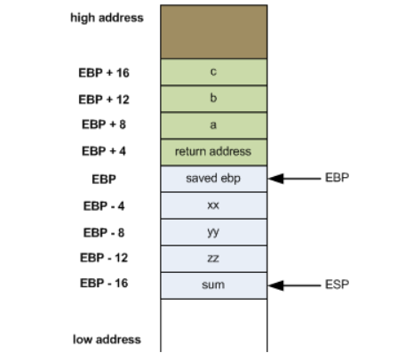
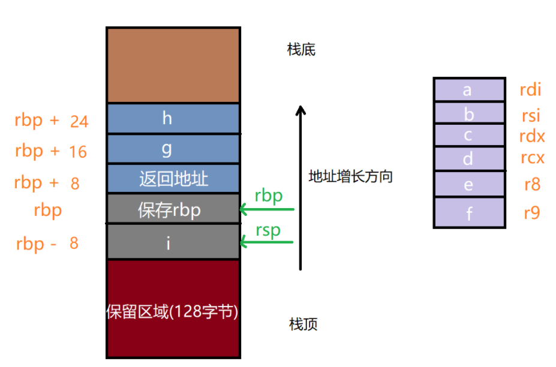

> 參考網頁: https://cs.lmu.edu/~ray/notes/gasexamples/

第1個參數: rax、第2個參數: rdi、第3個參數: rdx、第4個參數: rcs、第5個參數: r7、第6個參數: r8

第6個之後放在stack

x86的函數回傳值是rdx

> hello.s 組合語言

```assembly
# ----------------------------------------------------------------------------------------
# Writes "Hello, World" to the console using only system calls. Runs on 64-bit Linux only.
# To assemble and run:
#
#     gcc -c hello.s && ld hello.o && ./a.out
#
# or
#
#     gcc -nostdlib hello.s && ./a.out
# ----------------------------------------------------------------------------------------

        .global _start

        .text
_start:
        # write(1, message, 13)
        mov     $1, %rax                # system call 1 is write
        mov     $1, %rdi                # file handle 1 is stdout
        mov     $message, %rsi          # address of string to output
        mov     $13, %rdx               # number of bytes
        syscall                         # invoke operating system to do the write

        # exit(0)
        mov     $60, %rax               # system call 60 is exit
        xor     %rdi, %rdi              # we want return code 0
        syscall                         # invoke operating system to exit
message:
        .ascii  "Hello, world\n"
```


`gcc -S footbar.c -o foobar_mac.s`


`gcc -S --verbose-asm footbar.c -o foobar_mac.s` 組合語言會詳細註解


`gcc -O3 ` : 可以對程式碼進行優化，讓程式碼變到最短


`gcc -c -fPIC` : 讓程式碼不用重新定位


暫存器: esp(32bit)、rsp(64bit)

ebp代表框架暫存器(定位點)，很多函數執行完要退回去都可以用這個定位

使用上面的sp去跑位置，讓程式碼運行




> foobar.c

```c
#include <stdio.h>

int foobar(int a, int b, int c)
{
    int xx = a + 2;
    int yy = b + 3;
    int zz = c + 4;
    int sum = xx + yy + zz;

    return xx * yy * zz + sum;
}

int main()
{
    int r = foobar(77, 88, 99);
    printf("r=%d\n", r);
}

```


````assembly


```
$ gcc -fverbose-asm -S fib.c -o fib.s
```

來源 -- https://eli.thegreenplace.net/2011/02/04/where-the-top-of-the-stack-is-on-x86

```
    .file    "foobar.c"
    .text
    .globl    _foobar
    .def    _foobar;    .scl    2;    .type    32;    .endef
_foobar:
# 進入函數前置堆疊操作，每一個副程式都會有一個ebp
    pushl    %ebp     # 保存上一層的框架暫存器(stack位置)
    movl    %esp, %ebp     # 把目前位置設成ebp
    subl    $16, %esp     # 保留空間會根據區域變數多寡而變化
# int xx = a + 2;
    movl    8(%ebp), %eax  # a, tmp95  # eax = a   ## 8(%ebp)代表ebp上面8格位置
    addl    $2, %eax       #, tmp94    # eax = eax + 2 
    movl    %eax, -4(%ebp) # tmp94, xx # xx = eax
# int yy = b + 3;
    movl    12(%ebp), %eax # b, tmp99  # eax = b
    addl    $3, %eax       #, tmp98    # eax = eax + 3
    movl    %eax, -8(%ebp) # tmp98, yy # yy = eax
# int zz = c + 4;
    movl    16(%ebp), %eax # c, tmp103  # eax = c
    addl    $4, %eax       #, tmp102    # eax = eax + 4
    movl    %eax, -12(%ebp) # tmp102,zz # zz = eax
# int sum = xx + yy + zz;
    movl    -4(%ebp), %edx # xx, tmp104  # edx = xx 
    movl    -8(%ebp), %eax # yy, tmp105  # eax = yy
    addl    %eax, %edx # tmp105, D.1501  # edx = edx + eax 
    movl    -12(%ebp), %eax # zz, tmp109 # zz = eax
    addl    %edx, %eax  # D.1501, tmp108 # eax = eax + edx
    movl    %eax, -16(%ebp) # tmp108,sum # sum = eax
# return xx * yy * zz + sum;
    movl    -4(%ebp), %eax     # xx, tmp110 # eax = xx
    imull    -8(%ebp), %eax    # yy, D.1501 # eax = eax * yy
    imull    -12(%ebp), %eax   # zz, D.1501 # eax = eax * zz
    movl    %eax, %edx     # D.1501, D.1501 # edx = eax
    movl    -16(%ebp), %eax   # sum, tmp111 # sum = eax
    addl    %edx, %eax     # D.1501, D.1501 # eax = edx + eax
# 離開前的後置堆疊處理動作
    leave   # 把之前保留的框架暫存器恢復
    ret     # 跳回之前的返回點
    .def    ___main;    .scl    2;    .type    32;    .endef
    .globl    _main
    .def    _main;    .scl    2;    .type    32;    .endef
_main:
    pushl    %ebp     # 放入stack暫存點
    movl    %esp, %ebp     # 
    andl    $-16, %esp     #
    subl    $16, %esp     #  保留要stack的空間，在遞迴的時候，不會讓變數被蓋掉
    # 上面4行是固定的主程序操作
    call    ___main      #
    movl    $99, 8(%esp) #, 把 99 傳給 c
    movl    $88, 4(%esp) #, 把 88 傳給 b
    movl    $77, (%esp)  #, 把 77 傳給 a
    call    _foobar      #  呼叫 foobar (a=77,b=88,c=99)
    leave
    ret
    .ident    "GCC: (tdm-1) 5.1.0"
```
````


> https://codingnote.cc/zh-tw/p/116157/




`lesq (x, y, int k), x ` : x = x+k*y


內嵌式組合語言

https://ithelp.ithome.com.tw/articles/10213500

在作業系統啟動時，往往會需要組合語言，有時候組合語言只需要一點點，所以就把他內嵌在C裡面了，Linux Core 有很多這樣的寫法

> inline.c

```c
#include <stdio.h>
#include <stdint.h>

int main(int argc, char **argv)
{
    int32_t var1=10, var2=20, sum = 0;
    asm volatile ("addl %%ebx,%%eax;"
                 : "=a" (sum)              /* output: sum = EAX */
                 : "a" (var1), "b" (var2)  /* inputs: EAX = var1, EBX = var2 */
    );
    printf("sum = %d\n", sum);
    return 0;
}
```


> jit.c

```c
// 修改自 -- https://github.com/spencertipping/jit-tutorial/blob/master/jitproto.c
#include <stdio.h>
#include <stdlib.h>
#include <assert.h>
#include <string.h>
#include <sys/mman.h>

typedef long(*fn)(long);

int main() {
  // 使用nmap讓他可以執行
  char *memory = mmap(NULL,             // address
                      4096,             // size
                      PROT_READ | PROT_WRITE | PROT_EXEC,
                      MAP_PRIVATE | MAP_ANONYMOUS,
                      -1,               // fd (not used here)
                      0);               // offset (not used here)
  assert(memory != NULL);
  char code[] = {
    0x48, 0x8b, 0xc7 /*mov %rdi, %rax*/, 
    0xc3 /*ret*/
  };
  memcpy(memory, code, 4);
  fn f = (fn) memory;

  int i;
  for (i = 0; i < 10; ++i)
    printf("f(%d) = %ld\n", i, (*f)(i));
  munmap(f, 4096);
  return 0;
}
```


objdump 可以把目的檔反組譯，讓我們可以知道機器碼對應的組合語言

```
gcc -O3 -c add.c -o add  // 最小化程式碼
objdump -d add
```

