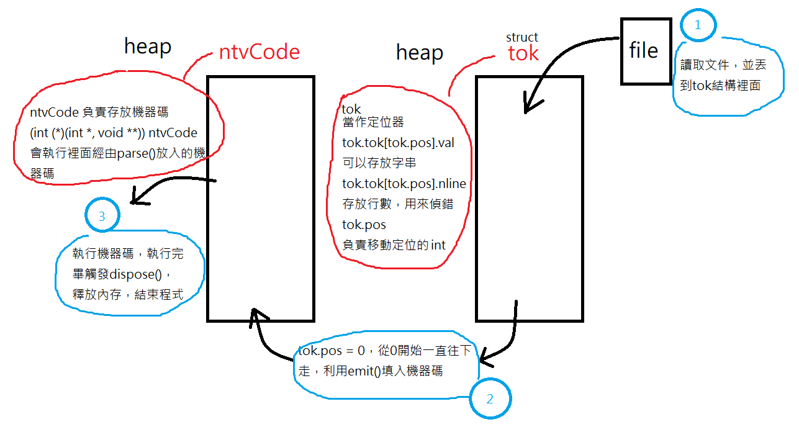

# rubi 介紹

下面是我研究 [rubi 編譯器](https://github.com/embedded2015/rubi) 後寫成的報告

rubi 是一種高效能的腳本編成語言，裡面的核心技術是使用快速編譯(塞入機器碼)，下面是我對全部的程式碼做的一些註解和個人看法，在每個文件的底下會有我自己在過程中遇到的問題，大多我都還沒找到答案，一定是因為裡面太多組合語言了 QQ

- [asm.h、rubi.h 文件介紹](rubi/asm.md)
- [engine.c 文件介紹](rubi/engine.md)
- [expr.h、expr.c 文件介紹](rubi/expr.md)
- [parser.h、parser.c 文件介紹](rubi/parser.md)
- [stdlib.c 文件介紹](rubi/stdlib.md)
- **[c語言函數說明](rubi/function.md)**: 裡面介紹上面的文檔用的所有怪怪的函數


rubi要如何執行，可以直接到這裡看: https://github.com/embedded2015/rubi#quick-start

rubi的程式碼範例: [hello.rb](test/hello.rb)、 [sum.rb](test/sum.rb)、 [fib.rb](test/fib.rb)、https://github.com/embedded2015/rubi/tree/master/progs


# rubi 編譯過程

一開始會先由 engine.c 開始，裡面有 main 觸發主函數，透過argv，可以讀取到文件名，就可以對指定的rubi文件進行編譯了 !!，這個專案神奇的地方就是不會產生執行檔案，會把機器碼塞入記憶體，直接跑出結果 !!


主要運行流程: 先讀取rubi文件的code，把它丟到內存，然後使用`engine.c`裡面的`execute()`開始執行程式碼W

```c
static int execute(char *source)
{
    init();  // 初始化內存
    lex(source);  // 把rubi文件內容複製到自訂結構tok
    parser();   // 解析語句
    // 下面這行大概可能我猜是把funtion設在ebp那邊，然後需要呼叫什麼函數，只需要jump到指定位置就OK了
    (int (*)(int *, void **)) ntvCode;  // 執行機器碼
    dispose();  // 執行完畢，釋放內存
    return 0;
}
```


在init的時候，程式碼會先初始化內存，分配動態記憶體給 ntvcode，設置記憶體權限讓該區域可以執行機器碼，利用ntvCode[ntvCount] = val 填入機器碼，從而達到立即編譯的效果。而tok也會分配記憶體，在lex的時候，就會把rubi文件內容存到tok裡面，並記錄，方便後面parser去對語句做解析，並直接使用emit()塞程式碼，最後會把ntvCode直接轉成function的型態直接執行，跟老師的jit.c範例一樣。

下面用一張圖說明大概架構



在語句分析的時候，會是這樣的流程: `parser() -> eval() -> expression() -> relExpr()`

`expression() `是`parser.c` 裡面處理語句的主要呼叫函數，使用skip判斷字串(使用到rubi.h裡面的tok結構)，從而對應塞入不同機器碼

`relExpr()`是 `expr.c` 裡面處理字符細節的主要呼叫函數，一樣使用到rubi.h裡面的tok結構，利用tok位置移動判斷字符類型


rubi的編譯器其實我還是有一些地方是看不懂的，尤其是emitI32的部分，因該說，有關機器碼塞入的部分，都怪怪的，像是stdlib，裡面呼叫函數竟然是: `emit(0xff); emit(0x56); emit(12); // call malloc`、`emit(0xff); emit(0x56); emit(24); // call add_mem`，後面只因為塞的是不同數字就呼叫了不同function，這一定是`parse()`前面塞入的那個奇怪機器碼搞得鬼...


